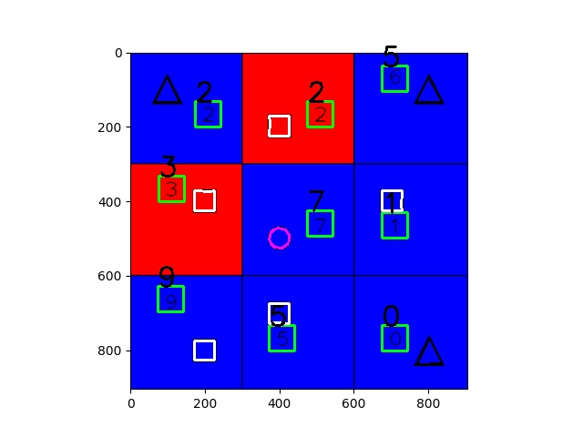

# 斋藤康毅深度学习入门：基于Python的理论与实现

> 开头链接：[深度学习入门：基于Python的理论与实现 (ituring.com.cn)](https://www.ituring.com.cn/book/1921)
>
> 寒假重新学习神经网络，真心觉得这本书很适合入门，结合吴恩达的神经网络和机器学习课程，看完之后可以直接去看懂一点点pytorch教程了

在开头链接的原文件代码的基础上自己在跑的时候整合成一个一个`ipynb`文件了，还实现了之前自己参加学校比赛做的一个图像识别工作，其中的数字识别自己是用就是用一个深层网络做的，识别的准确率非常高，执行代码在`ch8.ipynb`文件中，个人感觉学完这本书之后就可以直接去看pytorch教程了。

